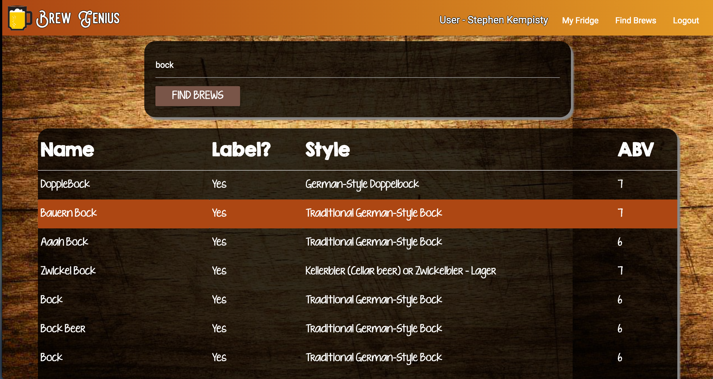

# Brew Genius v0.9
### Author: Stephen Kempisty
 

 

==========

##Introduction

Welcome to Brew Genius! Sign up to start looking for beers you might like to try through our "Find Brews" feature all powered by BreweryDB! BreweryDB is publicly available crowdsourced database of beer! Build up a fridge full of wish list beer that you can discover here on Brew Genius!

Development is ongoing, and many more features such as a better search function, further
web design, and social media connectivity are soon to come!
 
##Technologies

Brew Genius is developed using the MEAN stack which includes MongoDB, Express,
Angular, and Node. No installation is required to use Brew Genius.

&nbsp;

- HTML
- CSS 
- Javascript
- jQuery
- Materialize
- MongoDB
- Express
- Angular
- Node

#### API
- BreweryDB 

##Design

The general design approach around Brew Genius was to demonstrate the use of Angular in a MEAN app. An attempt was made to incorporate as many features of Angular as possible that would be 
feasible to complete in a one week sprint. 

While seemingly simple, Brew Genius requires careful interaction between frontend and backend aspects of the code base. Ajax requests made in the front end communicate with the backend which then makes requests to BreweryDB, then returns the results to the frontend for delivery to the user. Signing up and logging in require an issuance of a JSON web token to local storage once user credentials are verified which keeps the site informed of the user's logged in status.

##Get Started

<a href="https://fierce-journey-62903.herokuapp.com/">Visit Brew Genius!</a>

If you would like to contribute to further development of Brew Genius, feel free to fork this repository. Permission to snoop around in the code is given whole-heartedly!

##Next Steps
There are many exciting features planned that unfortunately did not make it into the release version of Brew Genius. Please check back for future versions. New features such as the following are coming soon!

- More comprehensive search feature
- Checkoff your fridge items!
- A fully designed fridge page
- Fleshing out of the home page
